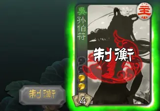
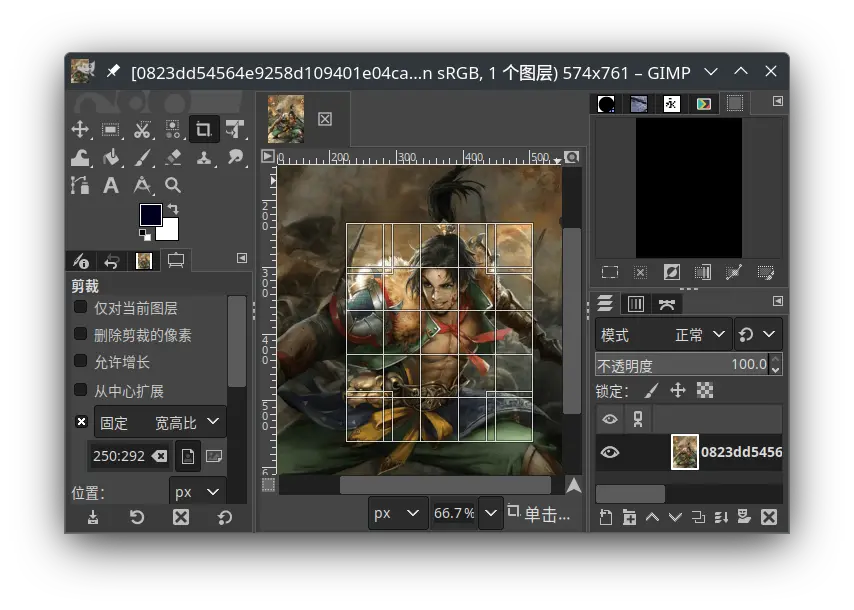

.. SPDX-License-Identifier: GFDL-1.3-or-later

创建武将并添加技能
==================

欲创建技能，必先有武将；而想要创建武将，先要创建拓展包。拓展包是一个武将的容身之处。

之前的fk_study应该都还在吧？我们看看在搭建环境的那一章中，我们所编写的代码：

.. code:: lua

   local extension = Package("fk_study")

   Fk:loadTranslationTable{
     ["fk_study"] = "fk学习包",
   }

   local study_sunce = General(extension, "study_sunce", "wu", 4)
   Fk:loadTranslationTable{
     ["study_sunce"] = "孙伯符",
   }

   return { extension }

在这个Lua文件中，我们创建了一个拓展包，并往拓展包中添加了一名武将。

--------------

创建拓展包
----------

创建拓展包的格式基本是固定的，在Lua文件的第一行写上这样的：

::

   local extension = Package("xxxx")

其中xxxx为拓展包的名字，可以随意填写。然后在Lua的最后一行写上：

::

   return { extension }

这样就能让fk知道这有个拓展包了，于是fk就能读取并将其加载到游戏里面。

--------------

翻译
----

fk的编程约定之一就是不要在代码中含有中文。需要显示为中文的部分，应该单独写在“翻译表”里面，而在主体代码涉及的字符串应使用英文，或者自定义的变量名。

加载翻译表的基本格式为：

.. code:: lua

   Fk:loadTranslationTable{
     ["源文本"] = "译文",
     ......
   }

像这样就可以插入许多条翻译了。

--------------

创建武将
--------

创建武将的格式为：

::

   local xxx = General(拓展包, 武将名, 势力, 体力值, 体力上限, 性别)

其中：

-  拓展包表示武将所在的拓展包，无脑extension完事
-  武将名是武将的内部名称，不要和别人重复了。如果你在做自己的拓展包的话建议加前缀
-  势力是武将的势力，目前有这几种：\ ``"wei"``\ ，\ ``"shu"``\ ，\ ``"wu"``\ ，\ ``"qun"``\ ，\ ``"god"``\ ，分别代表魏蜀吴群神
-  体力值是武将的初始体力值
-  体力上限是武将的体力上限，可以不写，不写的话默认等于体力值
-  性别是武将的性别，默认为男性，有以下几种取值可能：

   -  ``General.Male``\ ：男性
   -  ``General.Female``\ ：女性

--------------

为武将添加游戏已有技能
----------------------

fk本身不内置多少技能，但玩家还是可以给武将添加已有的技能，避免重复劳动。

比如我们的fk_study包，现在要给白板孙伯符加一个技能“制衡”，那么可以这样写：

::

   study_sunce:addSkill("zhiheng")

这样的一行代码必须在创建武将之后再添加。也就是说，添加之后，Lua文件大概像这样：

::

   local study_sunce = General(extension, "study_sunce", "wu", 4)
   study_sunce:addSkill("zhiheng") -- 在这里新增
   Fk:loadTranslationTable{
     ["study_sunce"] = "孙伯符",
   }

保存一下，进游戏就能发现多了个技能。

   添加已有技能

--------------

为武将制图
----------

此时我们还没有为武将制作图片。没有图片的武将，默认会用貂蝉的剪影作为图片。（其实手刹里面未知武将是周瑜的剪影，不过谁在乎呢）

总之我们来为武将制图。首先找一张心仪的图片。然后我们要找一个切图的软件，用PS也好，gimp也好，都随意，这里不赘述怎么用软件。

fk中，武将的图片应该为250x292分辨率，并且是jpg格式。为了观感舒适，武将的人脸应该位于图片的中上方。

   使用GIMP切图。我倾向于开5x5参考线，并让人脸位于2行3列的格子里面

最后用jpg格式导出图片，图片的名字是武将的内部名称，在这里就是study_sunce。

注意了，JPG图片的质量不能拉到100%，不然图片体积会很大，给他人下载你的拓展包带来不便。一般质量为90为好，此时图片大约三四十KB大小。这里图像质量只调了60，这样看起来不至于完全失真，图片的体积也相当较小。

至此我们做好了图片，接下来就是把图片放到游戏去。

去我们的拓展包文件夹，新建文件夹image，再在里面新建文件夹generals，把图丢进去。这样一来，拓展包的文件结构如下：

::

   packages/fk_study
   ├── image
   │   └── generals
   │       └── study_sunce.jpg
   └── init.lua

然后打开游戏，进入武将一览，就能看到武将的图片了。

--------------

为武将制作阵亡语音
------------------

每个武将都有自己的阵亡语音。fk采用mp3格式保存语音。

怎么处理mp3音频就不叙述了，可以考虑用audacity这款软件调节mp3的音量、去掉首尾的延迟等等。但是依然需要注意一点——mp3语音的体积不能太大了。为此我的建议是使用格式工厂对mp3文件再进行一次格式转换，将转换后mp3文件的码率设为128kbps，这样一来一句语音差不多就是三四十KB的感觉，而音质却不至于非常模糊。

阵亡语音放到拓展包文件夹下的audio/death里面，命名规则是武将的内部名称。

--------------

更新拓展包
----------

我们也做了这么多了，是时候更新一下了。

在我们拓展包文件夹那里右键一下，Git Bash Here，然后：

.. code:: sh

   $ git add .
   $ git commit -m "image and audio for sunce"
   $ git push

至此，就完成了拓展包的更新。其他使用你的拓展包的人此时就能通过fk拓展包管理的“更新拓展包”功能，更新到你所做的这个状态。

（我自己在写这一系列的文章的时候，也是确实创建了一个拓展包仓库的。
https://gitee.com/notify-ctrl/fk_study
如有疑问，可以去查看那个仓库是怎么弄的。）
