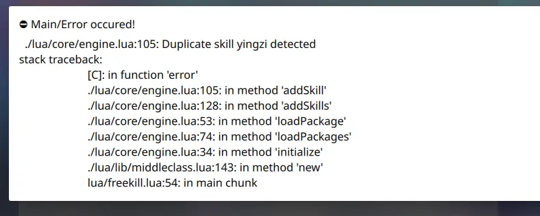

.. SPDX-License-Identifier: GFDL-1.3-or-later

创建新技能
==========

fk体量实在太小，只有标包，欲玩到更多技能，还是得自己亲自动手才行。

如何快速上手编写技能？答案是——复制粘贴。直接复制已有的技能代码以为己用，并且推敲那段技能代码的原理，无疑是上手的最快方法。

本文将实现这样一个技能：“摸牌阶段，你可以多摸4张牌。”

很明显，这个技能就是一个加强版的英姿。将英姿的代码复制过来，稍微改改即可。接下来和大家细说怎么来复制粘贴。

--------------

首先，fk所有的技能都是Lua编写的，而本着开源精神也没有对Lua代码进行任何特殊处理，因此你可以直接在fk的release版中找到lua代码。英姿是标包的，因此去packages/standard/init.lua，可以找到英姿的代码：

.. code:: lua

   local yingzi = fk.CreateTriggerSkill{
     name = "yingzi",
     anim_type = "drawcard",
     events = {fk.DrawNCards},
     on_use = function(self, event, target, player, data)
       data.n = data.n + 1
     end,
   }

好的，复制过来。注意到标包lua里面，英姿在定义武将周瑜的前面，所以我们也把技能粘贴到武将的前面。完事之后，把技能加给武将。至此我们的lua会像这样：

.. code:: lua

   local yingzi = fk.CreateTriggerSkill{
     name = "yingzi",
     anim_type = "drawcard",
     events = {fk.DrawNCards},
     on_use = function(self, event, target, player, data)
       data.n = data.n + 1
     end,
   }
   local study_sunce = General(extension, "study_sunce", "wu", 4)
   study_sunce:addSkill("zhiheng")
   study_sunce:addSkill(yingzi)
   Fk:loadTranslationTable{
     ["study_sunce"] = "孙伯符",
   }

启动游戏试试看，却给我们甩了个报错：

原来是这个复制粘贴的技能和已有的英姿重复了。解法很简单，换个名字就行了，这里改名为“激姿”好了。按照命名习惯，为他起一个内部名称”study_jizi”。然后把所有的yingzi都改成这个名，改名后如下：

.. code:: lua

   local study_jizi = fk.CreateTriggerSkill{
     name = "study_jizi",
     anim_type = "drawcard",
     events = {fk.DrawNCards},
     on_use = function(self, event, target, player, data)
       data.n = data.n + 1
     end,
   }
   local study_sunce = General(extension, "study_sunce", "wu", 4)
   study_sunce:addSkill("zhiheng")
   study_sunce:addSkill(study_jizi)

重新启动一下游戏，发现正常了，但是只能多摸一张。解法很简单，那句\ ``data.to = data.to + 1``\ 不就是让摸牌数+1吗，那我改成+4就行了，直接把1改成4：

.. code:: lua

     data.n = data.n + 4

还有一件事，我们没给技能加翻译，往翻译表加上：

.. code:: lua

     ["study_jizi"] = "激姿",
     [":study_jizi"] = "摸牌阶段，你可以多摸4张牌。",

至此完事了。别忘了更新一下git，后面不赘述关于git的事情了。

--------------

稍微解说一下创建技能的语法
--------------------------

我们再来回头看看刚才复制粘贴的代码。

首先可以看出，技能是通过\ ``fk.CreateTriggerSkill``\ 创建的。在这个函数名中，Create意为创建，TriggerSkill则是我们要创建的技能类型——触发技。要创建其他技能也一样，都是通过CreateXXXSkill创建的。

然后，对于所有技能，我们都要为其指派一个name，用来标记这个技能的名字。这个技能的名字必须是唯一的，不能和其他任何技能产生冲突，最广泛的避免重名的方法就是给技能加上一些前缀。

然后有些技能还指派anim_type。这个其实可有可无，它控制的是技能发动时该播放哪种动效，有以下几种取值：

-  ``special``\ ：留空anim_type时候的默认特效。看上去像一条龙的特效，一般用于定位模糊的技能。
-  ``drawcard``\ ：看上去像是凤凰展翅的特效，用于主打摸牌的技能。
-  ``control``\ ：看上去像草的特效，用于拆牌等控场类技能。
-  ``offensive``\ ：看上去像火焰的特效，用于菜刀技能或者直伤等攻击性技能。
-  ``support``\ ：看上去像莲花的特效，用于给牌、回血等辅助性技能。
-  ``defensive``\ ：看上去像花的特效，用于防御流技能。
-  ``negative``\ ：看上去像乌云的特效，用于负面技能。
-  ``masochism``\ ：看上去像金色的花的特效，用于卖血类技能。（这个类型取名也是沿用了神杀的恶趣味啊）

这些特效的图片素材位于image/anim/skillInvoke中。你可以改变技能的anim_type一一查看，或者直接去看素材也行。但是记住一点，这个属性除了控制技能触发的特效之外，和技能本身并没有任何联系，你想指定啥都行。
